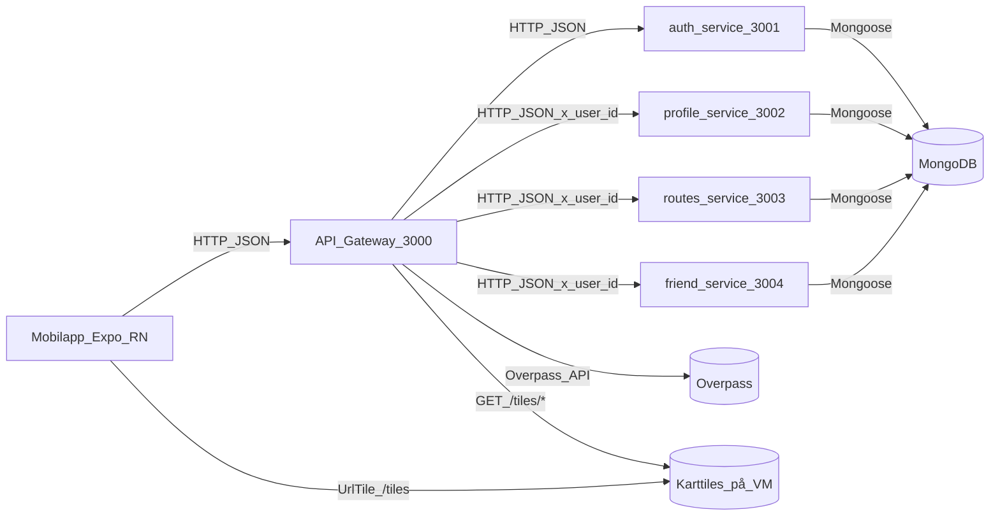

# Hur Utmark fungerar

Det här dokumentet förklarar hela kodbasen: hur monorepot hänger ihop, hur en request rör sig genom systemet, vilka services som finns och var man hittar det man letar efter. Det är tänkt för någon som vill förstå *arkitekturen* och *varför* vi byggt som vi gjort — inte bara hur man startar appen (det står i `README.md`).

---

## Översikt

Stacken består av sex delar:

1. **Mobilapp** (Expo / React Native) — det användaren faktiskt trycker på.
2. **API Gateway** (Express + Node.js + TypeScript, port `3000`) — den enda publika ingången som mobilen pratar med.
3. **auth-service** (port `3001`) — konton, lösenordshashning, utfärdar JWT.
4. **profile-service** (port `3002`) — profiler och statistik (badges).
5. **routes-service** (port `3003`) — sparade rutter, aktiva runs, utmaningar.
6. **friend-service** (port `3004`) — vänförfrågningar, vänlista, sök.

De fyra interna servicerna pratar med **samma MongoDB** (men olika collections). Mobilen rör aldrig databasen direkt — den pratar bara med gatewayen.

Inloggning bygger på **JWT**: mobilen sparar en signerad token och skickar med den på varje skyddad request.



Det viktigaste att ta med sig:

- Gatewayen är den enda service mobilen känner till.
- Gatewayen verifierar JWT och proxar vidare — den har ingen egen databas.
- Efter att gatewayen verifierat en token skickar den bara vidare ett `x-user-id`-header till interna services. Servicerna litar på det headerna (de behöver inte verifiera JWT själva).
- Ruttgenerering och grönområdessökning (Overpass API) sker direkt i gatewayen.

---

## 1. Mappstruktur

### Repo-roten

```
apps/
  api/               ← API Gateway
  auth-service/      ← konton + auth
  profile-service/   ← profiler + stats
  routes-service/    ← rutter, runs, challenges
  friend-service/    ← vänner
  mobile/            ← Expo-app
packages/
  types/             ← delade TS-typer (definierade, men inte importerade överallt)
docs/                ← du är här
.github/workflows/   ← CI (format, lint, test)
ecosystem.api.config.js        ← PM2: gateway
ecosystem.services.config.js   ← PM2: alla fyra interna services
```

### Gateway — `apps/api/src/`

```
app.ts              ← Alla gateway-routes ligger här (menyn)
server.ts           ← startar Express (gatewayen har ingen DB)
config/env.ts       ← läser .env: PORT, JWT_SECRET, service-URL:er, CORS_ORIGIN
middleware/
  authMiddleware.ts ← verifierar JWT Bearer-token → req.userId
  errorHandler.ts   ← gör kastade fel till rent { error }-JSON
controllers/
  routeController.ts     ← generateRouteController (logik för checkpoints)
  greenAreaController.ts  ← listGreenAreas (anropar Overpass)
services/
  GreenAreaService.ts    ← wrapper mot Overpass API
utils/jwt.ts        ← signToken / verifyToken
routes/routeRouter.ts   ← router för ruttgenerering
```

### Interna services — alla följer samma form

```
apps/<service>/src/
  app.ts              ← Express-app + routes
  server.ts           ← lyssnar på sin port
  config/db.ts        ← Mongoose-anslutning
  config/env.ts       ← läser .env
  models/             ← Mongoose-scheman
  controllers/        ← request-hanterare
  middleware/
    gatewayAuthMiddleware.ts  ← litar på x-user-id (ingen JWT-verifiering)
    errorHandler.ts
```

### Mobil — `apps/mobile/src/`

```
config/env.ts         ← läser EXPO_PUBLIC_API_URL
lib/api.ts            ← Nyckelfilen. Alla API-anrop + JWT-lagring sker här.
screens/              ← en fil per skärm (se avsnitt 6)
components/           ← delad UI (kartlager, bottom sheets, modaler, navbar)
hooks/                ← useTracking, useUserLocation, useUserBadges, …
services/
  LocationService.ts  ← samlar GPS-punkter under en run
data/badges.ts        ← badge-definitioner
services/badgeUnlock.ts ← logik för upplåsning av badges (på klienten)
storage/              ← AsyncStorage-wrappers (favoriter, firade badges)
context/BadgeCelebrationContext.tsx ← global modal-state för badge-upplåsning
types/navigation.ts   ← RootStackParamList
```

---

## 2. Komplett API-karta

### Gateway-endpoints (`apps/api/src/app.ts`)

| Metod | Path | Auth | Vad den gör |
|-------|------|------|-------------|
| GET | `/api/health` | Publik | `{ status: 'ok' }` |
| POST | `/api/auth/signup` | Publik | Proxy → auth-service |
| POST | `/api/auth/login` | Publik | Proxy → auth-service |
| GET | `/api/profile/me` | JWT | Proxy → profile-service + `x-user-id` |
| PUT | `/api/profile/me` | JWT | Proxy → profile-service |
| GET | `/api/stats/me` | JWT | Proxy → profile-service |
| POST | `/api/stats/complete-run` | JWT | Proxy → profile-service |
| POST | `/api/stats/increment-generated` | JWT | Proxy → profile-service |
| POST | `/api/stats/increment-shared` | JWT | Proxy → profile-service |
| POST | `/api/stats/increment-recieved` | JWT | Proxy → profile-service |
| POST | `/api/route-records` | JWT | Proxy → routes-service `POST /routes` |
| GET | `/api/route-records/:id` | JWT | Proxy → routes-service `GET /routes/:id` |
| POST | `/api/runs` | JWT | Proxy → routes-service |
| GET | `/api/runs/me` | JWT | Proxy → routes-service |
| PATCH | `/api/runs/:id/complete` | JWT | Proxy → routes-service |
| POST | `/api/challenges` | JWT | Proxy → routes-service |
| GET | `/api/challenges/me` | JWT | Proxy → routes-service |
| ALL | `/api/friends/*` | JWT | Catch-all proxy → friend-service |
| GET | `/api/green-areas` | Publik | Overpass-sökning (i gateway) |
| POST | `/api/routes/generate-route` | Publik | Checkpoint-generering (i gateway) |
| GET | `/tiles/*` | Publik | Serverar karttiles från `/var/www/html/tiles` |

### Interna service-endpoints

**auth-service `:3001`**

| Metod | Path | Vad den gör |
|-------|------|-------------|
| GET | `/health` | Hälsokoll |
| POST | `/auth/signup` | Validera → bcrypt-hash → User.create → JWT |
| POST | `/auth/login` | Validera → User.findOne → bcrypt.compare → JWT |

**profile-service `:3002`**

| Metod | Path | Vad den gör |
|-------|------|-------------|
| GET | `/health` | Hälsokoll |
| GET | `/profile/me` | Profile.findOne på x-user-id |
| PUT | `/profile/me` | Profile.findOneAndUpdate (upsert) |
| GET | `/stats/me` | UserStats.findOne |
| POST | `/stats/complete-run` | Uppdaterar streak, distans, antal runs |
| POST | `/stats/increment-*` | Ökar en specifik räknare |

**routes-service `:3003`**

| Metod | Path | Vad den gör |
|-------|------|-------------|
| GET | `/health` | Hälsokoll |
| POST | `/routes` | Sparar en genererad rutt |
| GET | `/routes/:id` | Hämtar en sparad rutt |
| POST | `/runs` | Startar en run (status: in_progress) |
| GET | `/runs/me` | Listar användarens runs (filtrerbart på status) |
| PATCH | `/runs/:id/complete` | Avslutar run + sparar track points |
| POST | `/challenges` | Skickar en ruttutmaning till en vän |
| GET | `/challenges/me` | Listar skickade/mottagna utmaningar |

**friend-service `:3004`**

| Metod | Path | Vad den gör |
|-------|------|-------------|
| GET | `/health` | Hälsokoll |
| GET | `/api/friends` | Listar accepterade vänner (sammanslaget med profiler) |
| GET | `/api/friends/count` | Antal vänner |
| GET | `/api/friends/pending` | Inkommande förfrågningar |
| GET | `/api/friends/search` | Söker användare på username |
| POST | `/api/friends/request/:friendId` | Skickar vänförfrågan |
| POST | `/api/friends/accept/:requesterId` | Accepterar vänförfrågan |
| DELETE | `/api/friends/:friendId` | Tar bort vän |

---

## 3. Genomgång: vad händer när du trycker "Skapa konto"?

Det här är den viktigaste genomgången — den rör varje lager från mobil till databas.

### Steg 1 — Skärmen anropar `signup()` (`CreateAccountScreen.tsx`)

Skärmen gör egentligen bara en sak: anropar `signup(email, password)` från `lib/api.ts`, och navigerar vidare vid lyckat resultat (eller visar felmeddelandet).

```tsx
const handleSignUp = async () => {
  try {
    await signup(email.trim(), password);
    navigation.navigate('CreateRoute', { from: 'CreateAccount' });
  } catch (err) {
    setMsg(err instanceof Error ? err.message : 'Sign up failed');
  }
};
```

Skärmen vet inte vad "signup" innebär under huven, och det är hela poängen.

### Steg 2 — `signup()` i `lib/api.ts`

```typescript
export async function signup(email: string, password: string) {
  const result = await request<AuthResponse>('/api/auth/signup', {
    method: 'POST',
    body: { email, password },
  });
  await tokenStorage.set(result.token);
  return result;
}
```

1. Anropar den interna hjälpfunktionen `request()` med `POST /api/auth/signup`.
2. Sparar den returnerade JWT:n i enhetens **säkra keychain** (`expo-secure-store`).
3. Returnerar svaret.

### Steg 3 — `request()` gör själva `fetch`

Det här är den **enda** platsen i hela mobilappen där `fetch()` anropas. Den:

- lägger alltid till `Content-Type: application/json`,
- lägger till `Authorization: Bearer <token>` om `auth: true` skickas in,
- serialiserar body till JSON,
- parsar svaret och returnerar det, eller kastar ett `Error` med serverns meddelande.

### Steg 4 — Requesten når gatewayen (`app.ts`)

Routen är registrerad ungefär så här:

```typescript
app.post('/api/auth/signup', async (req, res, next) => {
  try {
    await proxyJson(res, `${env.AUTH_SERVICE_URL}/auth/signup`, {
      method: 'POST',
      body: req.body,
    });
  } catch (err) {
    next(err);
  }
});
```

Två middlewares har redan kört: `cors()` (släpper in mobilen) och `express.json()` (parsar body). Det här är en publik route — ingen `authMiddleware`.

### Steg 5 — Gatewayen proxar till auth-service

`proxyJson` gör en intern `fetch` mot `http://127.0.0.1:3001/auth/signup`. **auth-service** gör sedan det riktiga jobbet:

1. Validerar request-body.
2. Normaliserar email till gemener.
3. `User.findOne({ email })` — avvisar om användaren redan finns.
4. `bcrypt.hash(password, 10)` — medvetet långsam hashning.
5. `User.create({ email, passwordHash })` → MongoDB.
6. `signToken({ userId })` → JWT (7 dagars giltighet som standard).
7. `res.status(201).json({ token, user })`.

### Steg 6 — Mobilen sparar token, skärmen navigerar

Tillbaka i `signup()` sparar `tokenStorage.set(result.token)` JWT:n. Skärmen navigerar sedan vidare till `CreateRoute`.

### Hela flödet

```
[Mobil] trycker "Skapa konto"
   │
   ▼ CreateAccountScreen.tsx (handleSignUp)
   │ anropar signup()
   ▼ lib/api.ts (signup → request → fetch)
   │
   ──── HTTP POST /api/auth/signup ────────────────────────►
                                               apps/api/src/app.ts
                                               cors() + json()
                                               proxyJson → :3001
                                                   │
                                                   ▼ apps/auth-service
                                                   1. validera
                                                   2. bcrypt.hash
                                                   3. User.create ──► MongoDB
                                                   4. signToken
                                                   5. res.json({ token })
   ◄──── HTTP 201 { token, user } ─────────────────────────
   │
   ▼ lib/api.ts: tokenStorage.set(token)
   │
   ▼ CreateAccountScreen: navigate('CreateRoute')
```

---

## 4. Genomgång: en skyddad request (`GET /api/profile/me`)

Samma mönster som ovan, men med ett extra steg: **authMiddleware** kör innan proxyn.

```typescript
app.get('/api/profile/me', authMiddleware, async (req, res, next) => {
  await proxyJson(res, `${env.PROFILE_SERVICE_URL}/profile/me`, {
    method: 'GET',
    headers: { 'x-user-id': req.userId! },
  });
});
```

### Vad `authMiddleware` gör

```typescript
export function authMiddleware(req, res, next) {
  const header = req.headers.authorization;
  if (!header?.startsWith('Bearer ')) {
    return res.status(401).json({ error: 'Missing or invalid Authorization header' });
  }
  try {
    const { userId } = verifyToken(header.slice('Bearer '.length));
    req.userId = userId;
    next(); // ← endast om token är giltig
  } catch {
    res.status(401).json({ error: 'Invalid or expired token' });
  }
}
```

Med ord:

1. Kolla efter `Authorization: Bearer <token>`. Saknas → 401, stopp.
2. `verifyToken(token)` — kontrollerar JWT-signaturen med `JWT_SECRET`. Giltig → returnerar `{ userId }`.
3. Sätt `userId` på `req` och anropa `next()`.
4. Om något kastas → 401. Controllern körs aldrig.

### Gatewayen lägger till `x-user-id`, profile-service litar på det

Gatewayen skickar aldrig vidare den råa JWT:n till interna services. I stället lägger den till `x-user-id: <userId>`. profile-service läser headern via `gatewayAuthMiddleware`:

```typescript
export function gatewayAuthMiddleware(req, res, next) {
  const userId = req.headers['x-user-id'];
  if (!userId) return res.status(401).json({ error: 'Missing x-user-id header' });
  req.userId = userId;
  next();
}
```

Det är säkert eftersom service-portarna **inte är publikt nåbara** (bundna till `127.0.0.1`). Bara gatewayen kan anropa dem.

---

## 5. Genomgång: att springa en rutt

Hela produktflödet, från att en rutt skapas till att en badge låses upp.

### 1. Generera en rutt

```
[Mobil] CreateRouteScreen
  användaren väljer startpunkt + distans
  ↓
POST /api/routes/generate-route   (publik, körs i gatewayen)
  ↓
routeController.generateRouteController
  ↓
GreenAreaService → Overpass API (hittar parker/skog nära startpunkten)
  ↓
Route-domänklassen → placerar checkpoints inom grönområden
  ↓
{ checkpoints: [...], distance } returneras till mobilen
```

### 2. Spara rutten (valfritt)

```
POST /api/route-records  (JWT)
  ↓ proxy
routes-service POST /routes
  ↓
RouteRecord.create → MongoDB
```

### 3. Starta en run

```
POST /api/runs  { routeId }  (JWT)
  ↓ proxy
routes-service POST /runs
  ↓
Run.create { userId, route, status: 'in_progress', startedAt }
  ↓
{ runId } returneras till mobilen
```

### 4. Spåra i realtid (på klienten)

`LocationService` samlar GPS-punkter. Hooken `useTracking` läser `expo-location` och kollar avståndet till nästa checkpoint. `CreateRouteScreen` hanterar alla tillståndsövergångar (checkpoint tagen → nästa checkpoint → rutt klar). Inga serveranrop sker under själva springandet.

### 5. Avsluta en run

```
PATCH /api/runs/:id/complete  { trackPoints, durationSeconds, distanceMeters, checkpointsCompleted }  (JWT)
  ↓ proxy
routes-service PATCH /runs/:id/complete
  ↓
Run.findByIdAndUpdate → status: 'completed', finishedAt, resultat sparas

POST /api/stats/complete-run  { distanceMeters, checkpointsCompleted }  (JWT)
  ↓ proxy
profile-service
  ↓
UserStats uppdateras: completedRunsCount++, totalDistanceMeters +=, streak-logik
```

### 6. Badge-upplåsning (på klienten)

När statistiken uppdaterats anropar appen `GET /api/stats/me` och kör `checkBadgeUnlocks(stats)` i `services/badgeUnlock.ts`. Nya upplåsta badges visas via `BadgeCelebrationContext`. Vilka badges som firats sparas lokalt så modalen inte dyker upp igen.

---

## 6. Mobilappen — skärmar

Alla skärmar registreras i `App.tsx` och typas via `RootStackParamList`.

| Skärm | Vad den gör |
|-------|-------------|
| `Home` | Startsida med bakgrundsvideo + Skapa konto / Logga in |
| `CreateAccount` | Email + lösenord → signup → navigera till CreateRoute |
| `Login` | Email + lösenord → login → navigera till CreateRoute |
| `Welcome` | Onboarding/intro |
| `ProfileUpsert` | Skapa eller redigera profil (username, namn, ålder, kön) |
| `CreateRoute` | **Huvudnavet.** Karta + ruttgenerering + aktiv run + bottennavigering. |
| `RouteStarted` | Övergångsskärm när en run startar |
| `CheckpointTaken` | Firande när en checkpoint nås |
| `RouteCompleted` | Sammanfattning av run (tid, distans, checkpoints) |
| `CancelRoute` | Bekräftelse vid avbruten run |
| `Favorites` | Sparade favoritrutter (lokalt i AsyncStorage) |
| `Profile` | Profil + statistik |
| `History` | Lista över tidigare runs |
| `RunDetail` | Detaljvy för en avslutad run |
| `Challenges` | Skickade och mottagna utmaningar |
| `Badges` | Hela badge-galleriet |
| `Friends` | Vänlista + sök |
| `FriendRequests` | Inkommande vänförfrågningar |

Skärmarna är medvetet **tunna**: de ritar UI, anropar funktioner i `lib/api.ts` och reagerar på resultat. De anropar aldrig `fetch` direkt — allt nätverksarbete sker i `lib/api.ts`.

---

## 7. Datamodeller (MongoDB)

Alla services delar `mongodb://127.0.0.1:27017/utmarkprojekt` (eller Atlas). Varje service äger sina egna collections.

### `users` — auth-service

```typescript
{
  email: string        // unik, gemener
  passwordHash: string // bcrypt
  createdAt, updatedAt
}
```

### `profiles` — profile-service

```typescript
{
  userId: ObjectId    // unik, ref users
  username: string    // unik
  fullName: string
  age: number
  gender: 'male' | 'female' | 'other'
  createdAt, updatedAt
}
```

### `userstats` — profile-service

```typescript
{
  userId: ObjectId    // unik
  routesGeneratedCount: number
  routesSharedCount: number
  routesRecievedCount: number
  completedRunsCount: number
  maxRunDistanceCompleted: number
  totalDistanceMeters: number
  dayStreakOfCompletedRuns: number
  lastRunCompletedAt: Date
  totalCheckpointsTaken: number
  createdAt, updatedAt
}
```

### `routrecords` — routes-service

```typescript
{
  createdBy: ObjectId
  start: { latitude: number, longitude: number }
  distance: number
  checkpoints: [{ id: string, coordinate: { latitude, longitude }, radius: number }]
  createdAt, updatedAt
}
// Index: { createdBy: 1, createdAt: -1 }
```

### `runs` — routes-service

```typescript
{
  route: ObjectId      // ref routrecords
  userId: ObjectId
  status: 'in_progress' | 'completed' | 'abandoned'
  startedAt: Date
  finishedAt?: Date
  durationSeconds?: number
  checkpointsCompleted?: number
  distanceMeters?: number
  trackPoints: [{ lat: number, long: number, timeStamp: number }]
  createdAt, updatedAt
}
```

### `routechallenges` — routes-service

```typescript
{
  route: ObjectId
  fromUserId: ObjectId
  toUserId: ObjectId
  sourceRun?: ObjectId
  status: 'pending' | 'accepted' | 'declined' | 'cancelled'
  createdAt, updatedAt
}
```

### `friendships` — friend-service

```typescript
{
  requester: ObjectId
  recipient: ObjectId
  status: 'pending' | 'accepted'
  createdAt, updatedAt
}
// Unikt sammansatt index: { requester: 1, recipient: 1 }
```

---

## 8. Drift & deployment

### Lokal utveckling

Varje app startas med `npm run dev` (backend, via `ts-node-dev`) respektive `npm run start` (Expo). Servicerna behöver egna `.env`-filer — kopiera från `.env.example`.

```bash
# I separata terminaler (eller använd PM2)
cd apps/auth-service    && npm run dev   # :3001
cd apps/profile-service && npm run dev   # :3002
cd apps/routes-service  && npm run dev   # :3003
cd apps/friend-service  && npm run dev   # :3004
cd apps/api             && npm run dev   # :3000
cd apps/mobile          && npm run start # Expo
```

### Produktion (VM + PM2)

```bash
# Bygg varje service (kör tsc i varje app)
npm run build

# Starta med PM2
pm2 start ecosystem.api.config.js       # gateway
pm2 start ecosystem.services.config.js  # alla fyra services
```

- Gateway på **port 3000** (publik, eller Nginx-proxy 80 → 127.0.0.1:3000)
- Services på **127.0.0.1:3001–3004** (inte publikt nåbara)
- Karttiles serveras från `/var/www/html/tiles` via gatewayens `/tiles/*`-route
- Mobilens standard-`EXPO_PUBLIC_API_URL` = `http://79.76.60.222:3000`

### CI (GitHub Actions)

Vid push/PR mot `main`:

1. `npm ci` i roten och i varje app
2. `npm run lint`
3. `npm test`

Formatering (Prettier) finns som script (`npm run format`) men körs inte som ett eget CI-steg i nuläget.

### Miljövariabler

| App | Viktiga variabler |
|-----|-------------------|
| `apps/api` | `PORT=3000`, `JWT_SECRET`, `JWT_EXPIRES_IN`, `CORS_ORIGIN`, `AUTH_SERVICE_URL`, `PROFILE_SERVICE_URL`, `ROUTES_SERVICE_URL`, `FRIENDS_SERVICE_URL` |
| `apps/auth-service` | `PORT=3001`, `MONGODB_URI`, `JWT_SECRET`, `JWT_EXPIRES_IN` |
| `apps/profile-service` | `PORT=3002`, `MONGODB_URI` |
| `apps/routes-service` | `PORT=3003`, `MONGODB_URI` |
| `apps/friend-service` | `PORT=3004`, `MONGODB_URI` |
| `apps/mobile` | `EXPO_PUBLIC_API_URL` |

`JWT_SECRET` måste vara **identisk** i `apps/api` och `apps/auth-service` — gatewayen verifierar, auth-service signerar.

---

## 9. "Var ändrar jag om jag vill…?"

| Mål | Fil(er) att ändra |
|-----|-------------------|
| Lägga till en gateway-endpoint | `apps/api/src/app.ts` |
| Lägga till en auth-endpoint | `apps/auth-service/src/app.ts` + `controllers/authController.ts` |
| Lägga till en profil-endpoint | `apps/profile-service/src/app.ts` + `controllers/` |
| Lägga till en routes/runs-endpoint | `apps/routes-service/src/app.ts` + `services/RoutesService.ts` |
| Lägga till en vän-endpoint | `apps/friend-service/src/app.ts` + `controllers/friendsController.ts` |
| Lägga till fält på en user | `apps/auth-service/src/models/User.ts` |
| Lägga till fält på en profil | `apps/profile-service/src/models/Profile.ts` |
| Lägga till fält i statistik | `apps/profile-service/src/models/UserStats.ts` |
| Lägga till en ny badge | `apps/mobile/src/data/badges.ts` + `services/badgeUnlock.ts` |
| Ändra JWT-giltighet / secret | `apps/api/.env` OCH `apps/auth-service/.env` (måste matcha) |
| Ändra vilka origins som får anropa API:t | `apps/api/.env` → `CORS_ORIGIN` |
| Ändra API-URL:en mobilen anropar | `apps/mobile/.env` → `EXPO_PUBLIC_API_URL` |
| Lägga till en mobil-API-funktion | `apps/mobile/src/lib/api.ts` (ny export via `request()`) |
| Lägga till en ny skärm | `apps/mobile/src/screens/` + registrera i `App.tsx` |
| Byta källa för karttiles | `apps/mobile/src/screens/CreateRouteScreen.tsx` (UrlTile) |
| Ändra felformat i gateway | `apps/api/src/middleware/errorHandler.ts` |
| Ändra felformat i en service | `errorHandler.ts` i respektive service |

---

## 10. Begreppsordlista

Standardbegrepp inom webbutveckling som vi använder genom hela projektet.

**JWT (JSON Web Token)** — en signerad sträng: `header.payload.signature`. Payloaden innehåller `{ userId }`. Signaturen räknas ut med `JWT_SECRET`, så bara vår server kan skapa giltiga tokens. Mobilen sparar JWT:n i `expo-secure-store` och skickar den som `Authorization: Bearer <jwt>` på varje skyddad request.

**Middleware** — funktioner som körs *före* route-hanteraren. Express kör dem i ordning. Varje kan antingen anropa `next()` för att fortsätta, eller svara och stoppa kedjan. Vi använder dem för CORS, JSON-parsning, JWT-verifiering, `x-user-id`-tillit och felhantering.

**Proxy** — gatewayen implementerar inte affärslogik för auth/profil osv. Den vidarebefordrar ("proxar") requesten till rätt intern service och skickar tillbaka det servicen svarar.

**`x-user-id`-header** — efter att ha verifierat en JWT tar gatewayen bort token och lägger i stället till en vanlig `x-user-id`-header. Interna services litar på den och behöver inte verifiera JWT själva.

**Controller** — en funktion som hanterar en specifik route. Tar `(req, res, next)`, gör det riktiga jobbet (validering, DB-frågor) och skickar ett svar.

**Mongoose / ODM** — Mongoose är en Object Document Mapper för MongoDB. Vi definierar scheman, får TS-typer och använder smidiga queries (`User.findOne`, `Run.create`) i stället för råa drivrutinsanrop.

**bcrypt** — en medvetet långsam hashfunktion för lösenord. Vi hashar innan vi sparar och använder `bcrypt.compare(plaintext, hash)` vid login. Det riktiga lösenordet sparas aldrig.

**SecureStore (`expo-secure-store`)** — krypterad nyckel/värde-lagring på iOS/Android. Används för att spara JWT:n mellan sessioner utan att lägga den i vanlig AsyncStorage.

**AsyncStorage** — React Natives enkla nyckel/värde-lagring (okrypterad). Används för mindre känslig data: favoritrutter, firade badge-ID:n.

**`async` / `await`** — JavaScripts sätt att skriva asynkron kod (nätverk, DB) som läses som synkron. `await` pausar tills ett Promise löser sig; fel propagerar till närmaste `try/catch`.

**Idempotent** — en request där upprepning med samma indata ger samma resultat. `PUT /api/profile/me` är idempotent — att anropa den två gånger med samma body lämnar DB:n i samma tillstånd. Därför använder vi PUT (inte POST) för att spara profiler.

---

## 11. Kända saker att känna till (teknisk skuld)

| Sak | Detalj |
|-----|--------|
| `packages/types` används inte fullt ut | Delade typer finns men dupliceras inline i services och mobil. Inget problem, bara inte inkopplat. |
| friend-service har fel `name` | `package.json` säger `@utmarkprojekt/auth-service`. Kosmetiskt, påverkar inte körningen. |
| Korsläsning mot DB | friend-service läser `profiles`-collectionen direkt via Mongoose. Fungerar eftersom alla delar samma MongoDB, men kopplar ihop servicerna. |
| Friendship-modell duplicerad | Både friend-service och routes-service definierar `Friendship`. Samma collection, så datan är konsekvent. |
| Ingen Docker | Deployment sker via VM + PM2, ingen docker-compose. |

---

## Vidare läsning

- [`docs/ONBOARDING_BEGINNER.md`](./ONBOARDING_BEGINNER.md) — kör lokalt, steg för steg
- `README.md` — kortfattad översikt och testguide för läraren
