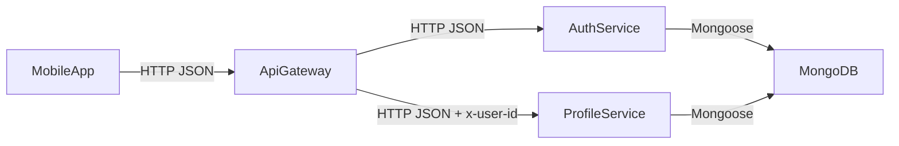

# Microservices on our VM (course requirement)

This project can run in a **microservice-style** setup: multiple independent backend servers that communicate over **HTTP**.

## Services (ports)

- **Gateway**: `apps/api` (public entrypoint) — `PORT=3000`
- **Auth service**: `apps/auth-service` — `PORT=3001`
- **Profile service**: `apps/profile-service` — `PORT=3002`

Mobile keeps a single API base URL and only talks to the Gateway.

## Request flow (proof for the teacher)



## Environment variables

### Gateway (`apps/api/.env`)

- `PORT=3000`
- `JWT_SECRET=...`
- `JWT_EXPIRES_IN=7d` (optional)
- `CORS_ORIGIN=*` (or your Expo origin)
- `AUTH_SERVICE_URL=http://127.0.0.1:3001`
- `PROFILE_SERVICE_URL=http://127.0.0.1:3002`

### Auth service (`apps/auth-service/.env`)

- `PORT=3001`
- `MONGODB_URI=...` (local MongoDB or Atlas)
- `JWT_SECRET=...` (must match Gateway)
- `JWT_EXPIRES_IN=7d` (optional)
- `CORS_ORIGIN=*` (optional)

### Profile service (`apps/profile-service/.env`)

- `PORT=3002`
- `MONGODB_URI=...` (same cluster is fine)
- `CORS_ORIGIN=*` (optional)

## Run locally (dev/demo)

Open 3 terminals:

```bash
# 1) Auth service
npm --prefix apps/auth-service install
npm --prefix apps/auth-service run dev

# 2) Profile service
npm --prefix apps/profile-service install
npm --prefix apps/profile-service run dev

# 3) Gateway
npm --prefix apps/api install
npm --prefix apps/api run dev
```

Then the mobile app continues to use the Gateway URL (e.g. `http://<vm-public-ip>:3000`).

## Run on VM (recommended)

For a stable VM setup use a process manager (PM2) or `systemd` so the 3 services restart automatically if the VM reboots or the process crashes.

## Networking on VM

Recommended: expose only the Gateway publicly (80/443 via Nginx, or 3000 if you keep it simple).

- **Public**: Gateway (Nginx → `127.0.0.1:3000`)
- **Internal only**: `127.0.0.1:3001` and `127.0.0.1:3002`

### Example: Nginx reverse proxy → Gateway

Create an Nginx site that forwards everything to the Gateway:

```nginx
server {
  listen 80;
  server_name _;

  location / {
    proxy_pass http://127.0.0.1:3000;
    proxy_http_version 1.1;
    proxy_set_header Host $host;
    proxy_set_header X-Real-IP $remote_addr;
    proxy_set_header X-Forwarded-For $proxy_add_x_forwarded_for;
    proxy_set_header X-Forwarded-Proto $scheme;
  }
}
```

Then you only need port **80/443** open publicly.

### Firewall idea (high level)

- Allow: `80/tcp`, `443/tcp`, `22/tcp`
- Do **not** allow public access to `3001`/`3002` (services should be reachable only from the Gateway on `127.0.0.1`).

